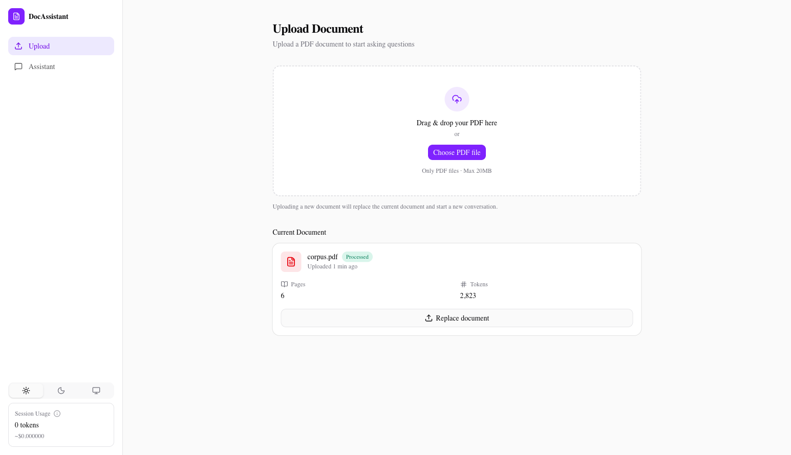
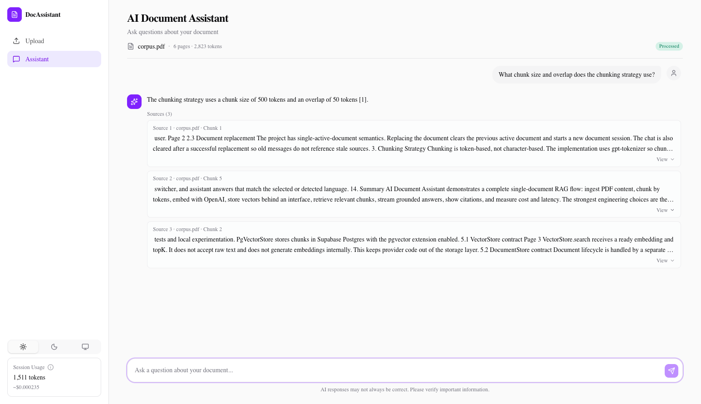
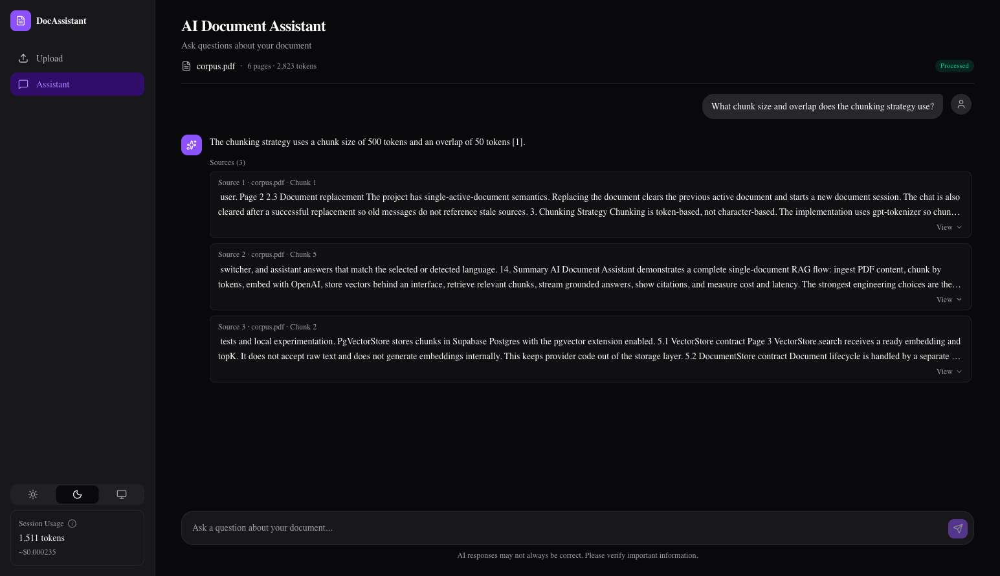

# AI Document Assistant

RAG-based PDF Q&A. Upload one PDF, ask questions, get streamed answers with citations to the source chunks.

Built as a portfolio project to demonstrate end-to-end AI engineering — chunking, embeddings, retrieval, streaming, citations, persistence, and **measured retrieval quality + cost** — over a deliberately small Next.js 16 surface.

**Live demo:** https://docassistant.vercel.app/



| Assistant — light                         | Assistant — dark                         |
| ----------------------------------------- | ---------------------------------------- |
|  |  |

---

## Highlights

- Drag-and-drop PDF upload → token-accurate chunking → batch embeddings → store → top-k retrieval → streamed cited answer.
- Storage abstracted behind a `VectorStore<T>` interface — swap **MemoryStore** ↔ **PgVectorStore (Supabase + pgvector)** with one env flag, no code changes.
- Live session-cost meter (tokens + USD) in the sidebar.
- Measured retrieval quality with a hand-annotated benchmark (Recall@1 66.7%, Recall@3 100%, Recall@5 100%).
- Streaming chat via the Vercel AI SDK, with citations rendered as expandable source cards.

---

## Benchmark results

Run via `npm run benchmark` against MemoryStore.

| Metric                    |        Value |
| ------------------------- | -----------: |
| **Recall@1**              |   **66.7 %** |
| **Recall@3**              |    **100 %** |
| **Recall@5**              |    **100 %** |
| Median retrieval latency  |   **407 ms** |
| Median end-to-end latency |   **~2.0 s** |
| Avg tokens / query        |    **1 541** |
| Avg cost / query          | **$0.00025** |

**What was measured**

- Corpus: a single PDF, `tests/fixtures/corpus.pdf` — 6 pages, **6 chunks** at 500-token chunks / 50-token overlap (token-accurate via `gpt-tokenizer`).
- 15 questions in `tests/eval/questions.json`, each with **manually annotated ground-truth chunk indices** (one canonical chunk per question; appendix repeats intentionally excluded so Recall is strict).
- Models: `text-embedding-3-small` for embeddings, `gpt-4o-mini` for generation. Production `TOP_K = 3`.

**Caveats — read these before drawing conclusions**

- **Recall@10 is omitted on purpose.** With only 6 chunks, top-10 returns the entire corpus, so Recall@10 would be 100 % by construction and tells you nothing. Recall@1 and Recall@3 carry the signal.
- **Retrieval latency includes the OpenAI embedding round trip.** Pure cosine search over 6 chunks is sub-millisecond; the 407 ms median is dominated by `text-embedding-3-small` API latency. Variance across runs is significant, so the median is reported instead of the mean.
- **Per-question detail** lives in `eval-results.json`. Five of the rank-1 misses are documented there — they cluster on questions whose answer also appears in the appendix or in adjacent overlap regions, where the appendix outranks the canonical section.
- **PgVectorStore** was verified end-to-end against Supabase (same retrieval correctness), but its latency depends on the network and the Supabase tier and is **not used for the headline numbers**.

---

## Architecture

```
PDF upload ─► extract (unpdf) ─► chunk (gpt-tokenizer) ─► embed (OpenAI batch)
                                                                │
                                                                ▼
                                                          VectorStore<T>
                                                          ├── MemoryStore (default)
                                                          └── PgVectorStore (VECTOR_STORE=pg)
                                                                │
question ─► embed (OpenAI) ─► retrieveChunks(query, k) ─────────┘
                                                                │
                                                                ▼
                                                       streamText (gpt-4o-mini)
                                                                │
                                                                ▼
                                                  streamed answer + sources
```

Two server entry points feed the same pipeline:

- **Server Action** `uploadDocument` (`app/actions/upload.ts`) — drives ingest end to end and calls `documentStore.replaceActive`.
- **Route Handler** `POST /api/chat` (`app/api/chat/route.ts`) — wraps `retrieveChunks` + `streamText` and emits the retrieved chunks as a `data-sources` stream part.

Two boundaries are enforced on purpose (see `AGENTS.md`):

1. The **vector store never touches OpenAI or raw text** — `retrieveChunks` (`lib/retrieval/retrieve-chunks.ts`) is the single place that calls `embedText`, then hands a ready embedding to `vectorStore.search`. This is what makes the Memory ↔ Pg swap a one-line config change.
2. **Document lifecycle is one abstraction up** (`lib/storage/document-store.ts`). The Server Action does not branch on which backend is in use.

---

## Retrieval

- Dense vector similarity, **top-k = 3** for answer generation, cosine similarity.
- 1536-dim embeddings (`text-embedding-3-small`), indexed in-memory or via pgvector's IVFFlat (`db/schema.sql`, `lists = 100`).

Intentionally **not** implemented:

- Reranking
- Hybrid BM25 + dense
- MMR / multi-vector indexing
- Query rewriting

These would help on a larger, more adversarial corpus, but the project optimizes for "simple > enterprise" per the spec, and the Recall@3 = 100 % result on the benchmark says the cost wasn't worth paying yet.

---

## Cost

| Item                             |              Price |
| -------------------------------- | -----------------: |
| `text-embedding-3-small` — input | $0.02 / 1 M tokens |
| `gpt-4o-mini` — input            | $0.15 / 1 M tokens |
| `gpt-4o-mini` — output           | $0.60 / 1 M tokens |

Encoded in `lib/usage/pricing.ts`; per-call usage is recorded by `lib/usage/tracker.ts` and surfaced live in the sidebar `UsageBlock`.

**Observed**: ~$0.00025 / query (≈ 1 540 tokens, mostly input). At the observed benchmark rate, a $5 OpenAI budget supports roughly 20,000 queries.
Actual costs depend on document size, chunk count, and prompt length.

---

## Stack

| Layer         | Choice                                                                          |
| ------------- | ------------------------------------------------------------------------------- |
| Framework     | Next.js 16.2.6 (App Router) · React 19.2.4 · TypeScript strict                  |
| Styling       | Tailwind v4 (CSS-first) · shadcn/ui on `@base-ui/react` · OKLCH palette · Geist |
| AI            | Vercel AI SDK 6 · `@ai-sdk/openai` 3 · `openai` 6                               |
| PDF / tokens  | `unpdf` · `gpt-tokenizer`                                                       |
| Storage       | `pg` + pgvector (Supabase) for the persistent path                              |
| Tests         | Vitest 4                                                                        |
| Bench harness | `tsx` (run as `npm run benchmark`)                                              |

---

## Local setup

1. **Install** dependencies:
   ```bash
   npm install
   ```
2. **Configure env**. Copy `.env.example` to `.env.local`:

   ```bash
   cp .env.example .env.local
   ```

   | Var              | Required                 | Purpose                                                        |
   | ---------------- | ------------------------ | -------------------------------------------------------------- |
   | `OPENAI_API_KEY` | yes                      | embeddings + chat                                              |
   | `VECTOR_STORE`   | no                       | `pg` → PgVectorStore; anything else → MemoryStore              |
   | `DATABASE_URL`   | yes if `VECTOR_STORE=pg` | Postgres connection (Supabase works; needs `vector` extension) |

3. **(Optional)** bootstrap Postgres if using `VECTOR_STORE=pg`:
   ```bash
   psql "$DATABASE_URL" -f db/schema.sql
   ```
4. **Run**:
   ```bash
   npm run dev
   # open http://localhost:3000
   ```

---

## Commands

| Command                           | What it does                                                      |
| --------------------------------- | ----------------------------------------------------------------- |
| `npm run dev`                     | Next dev server                                                   |
| `npm run build` / `npm run start` | Production build + serve                                          |
| `npm run lint`                    | ESLint (`eslint-config-next`)                                     |
| `npm run test`                    | Vitest single pass                                                |
| `npm run test:watch`              | Vitest watch mode                                                 |
| `npm run format` / `format:check` | Prettier                                                          |
| `npm run preview-chunks`          | Re-materialize `tests/eval/chunks.preview.md` from the corpus PDF |
| `npm run benchmark`               | Run the Recall + latency + cost harness against MemoryStore       |
| `npm run benchmark:pg`            | Same harness against PgVectorStore (verification only)            |

---

## Project structure

```
app/
├── actions/upload.ts          server action — PDF ingest
├── api/
│   ├── chat/route.ts          streaming chat (retrieveChunks + streamText)
│   └── usage/route.ts         GET session usage summary
├── assistant/page.tsx         chat UI
├── page.tsx                   upload UI
└── layout.tsx                 app shell, theme provider, chat provider

lib/
├── chunk/chunk-text.tsx       token-based chunking (500 / 50)
├── embeddings/embed-text.ts   single + batch embedding (size 100)
├── pdf/extract.ts             unpdf wrapper + deterministic doc id
├── retrieval/                 cosine-similarity + retrieveChunks (the only embedder caller)
├── storage/
│   ├── vector-store.ts        VectorStore<T> interface
│   ├── memory-store.ts        in-process O(n) cosine search
│   ├── pg-vector-store.ts     pgvector via `pg`
│   ├── document-store.ts      single-active-document lifecycle
│   └── store.ts               factory — switches on VECTOR_STORE
└── usage/                     tracker + per-model pricing

components/
├── chat/                      chat-provider, thread, message, composer, source-card
├── upload/                    dropzone, current-document-card
├── layout/                    app-shell, sidebar, mobile drawer
├── usage/usage-block.tsx      live token + cost widget
└── ui/                        shadcn primitives

scripts/
├── preview-chunks.ts          generate chunks.preview.md
└── benchmark.ts               recall + latency + cost harness

tests/
├── fixtures/corpus.pdf        benchmark corpus (6 pages, 6 chunks)
├── eval/
│   ├── chunks.preview.md      materialized chunk inventory
│   └── questions.json         15 hand-annotated questions
├── chunk/ embeddings/ retrieval/ storage/ usage/ api/
└── stubs/server-only.ts       Vitest stub

db/schema.sql                  pgvector tables + IVFFlat index
eval-results.json              latest benchmark results (committed for transparency)
```

---

## Limitations & future work

Deliberate non-goals (kept out to stay focused on RAG signal):

- No auth, no multi-user accounts.
- No multi-document chat — single active document at a time, with chat cleared on replacement so citations cannot point at stale chunks.
- No background jobs, queues, or webhooks. Ingest is synchronous.
- No production observability beyond the session-scoped usage tracker.
- No OCR for scanned PDFs.

Reasonable next steps if the project ever grew:

- Page-aware chunk metadata so source cards can show real page numbers.
- Hybrid retrieval (BM25 + dense) and a reranker — would matter on a larger corpus where Recall@1 starts to slip.
- Per-document chat histories with hard-refresh persistence.
- Persistent usage events instead of an in-memory tracker.
- i18n (English + Ukrainian) via `next-intl`.

---

## Tests

`npm run test` runs Vitest. Coverage is focused on the deterministic core:

- `tests/chunk/chunk-text.test.tsx` — chunk size, overlap, boundary behaviour.
- `tests/embeddings/embed-text.test.ts` — embedding wrapper contract.
- `tests/retrieval/cosine-similarity.test.ts` — math edge cases (identical, orthogonal, zero-magnitude, length mismatch).
- `tests/storage/memory-store.test.ts` — ranking, topK, embedding presence.
- `tests/usage/{tracker,pricing}.test.ts` — accumulation, per-model grouping, cost math.
- `tests/api/usage.test.ts` — route shape.

Not covered by unit tests (intentionally, given scope): UI components, server actions, full end-to-end retrieval-to-stream — the benchmark harness in `scripts/benchmark.ts` plays that role instead.

---

## AI workflow

This project was built with Claude Code as the primary AI assistant.
Prompting patterns, architectural decisions, and lessons learned are
documented in [ai-prompts.md](ai-prompts.md).
